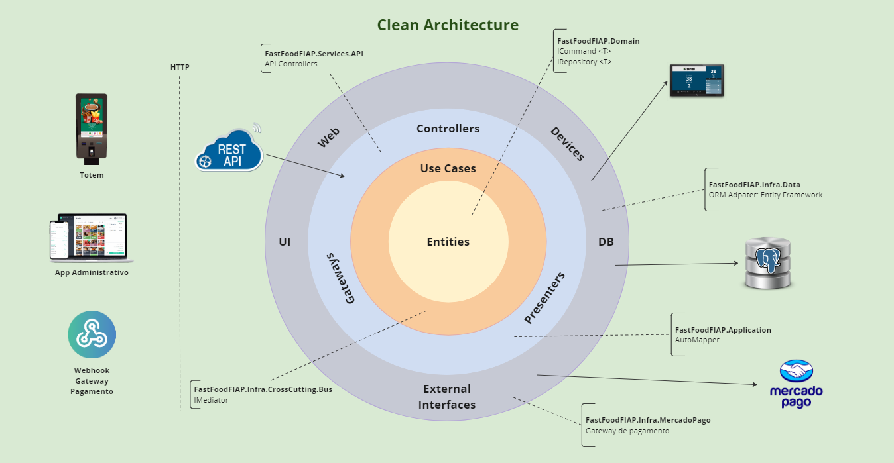
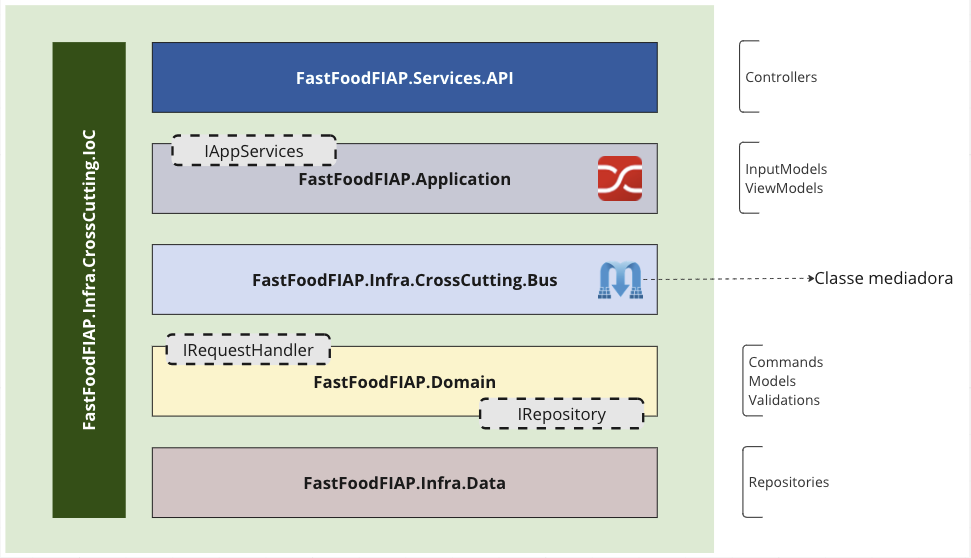

# [FIAP - Pos Tech] Fast Food - Produção API

#### Sumário
   * [O projeto](#o-projeto)
   * [Documentações](#documentações)
   * [Pré-requisitos](#pré-requisitos)
   * [Como rodar a aplicação <g-emoji class="g-emoji" alias="arrow_forward" fallback-src="https://github.githubassets.com/images/icons/emoji/unicode/25b6.png">▶️</g-emoji>](#como-rodar-a-aplicação-️)
   * [Tecnologias](#tecnologias)
   * [Arquitetura e Padrões](#arquitetura-e-padrões)
   * [Estrutura da solução](#estrutura-da-solução)
   * [Desenvolvedores ](#desenvolvedores-octocat)

## O projeto

O projeto consiste em um microservico responsável por gerenciar a produção/andamentos de um pedido, parte de um sistema de autoatendimento de fastfood.

No projeto atual temos as seguintes funcionalidades:
- Criar um novo andamento para o pedido;
- Listar todos os pedidos pela ordem de criação (REALIZADO);
- Listar todos os pedidos ativos (andamento ATUAL ainda não RETIRADO, CANCELADO ou FINALIZADO);
- Consultar o andamento atual de um pedido;
- Listar todos os pedidos que se encontram em uma situação específica.

## Banco de dados
Como o serviço de produção envolve envolve apenas o controle do andamento do pedido, ou seja, sem relacionamentos complexos, o sistema utiliza o banco de dados NoSQL MongoDB.

### Mongo Express
Usuário: admin
Senha: pass

## Tecnologias

- Runtime do .NET 6
    - C# 11.0
    - ASP.NET WebApi
    - Entity Framework
    - AutoMapper
    - Swagger UI
    - Moq
- MongoDB 
- Docker

## Arquitetura e Padrões

- Arquitetura Limpa (Clean Architecture)
- Domain Driven Design (DDD)
- Domain Events
- CQRS
- Unit of Work
- Repository

## Estrutura da solução

 
